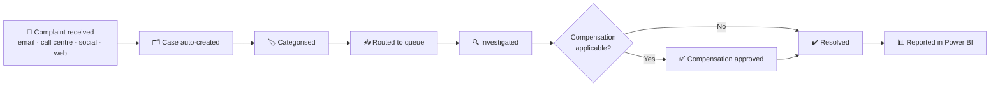
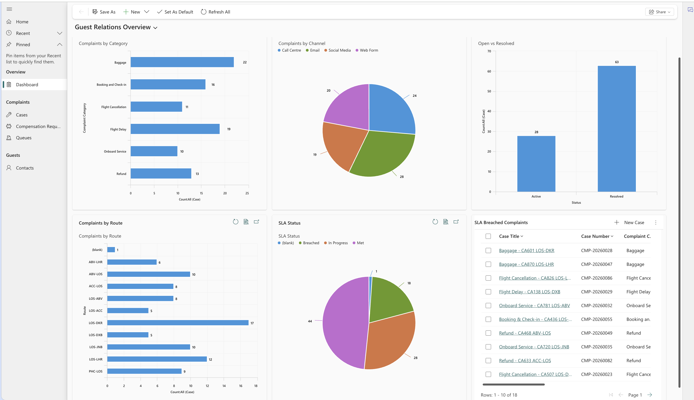
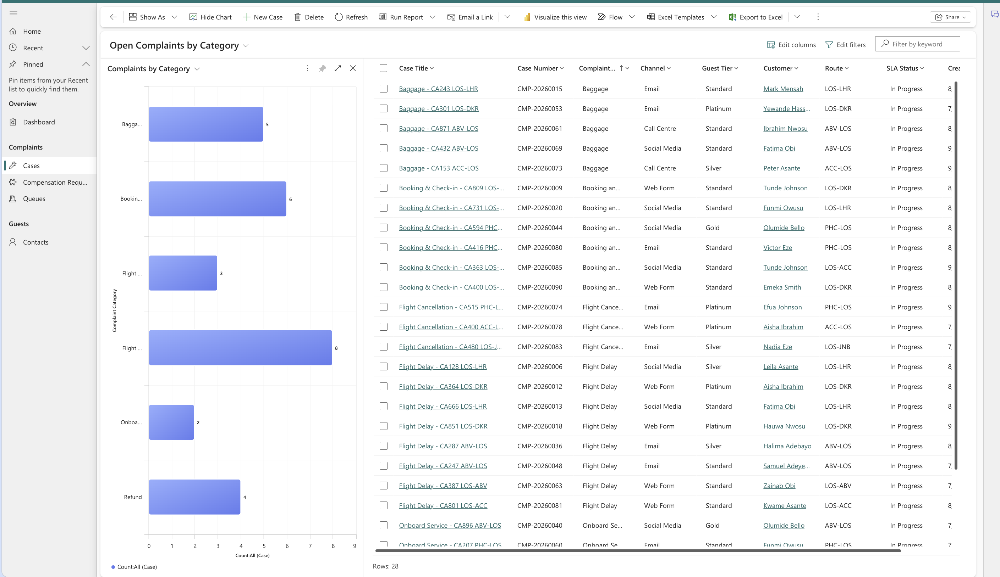
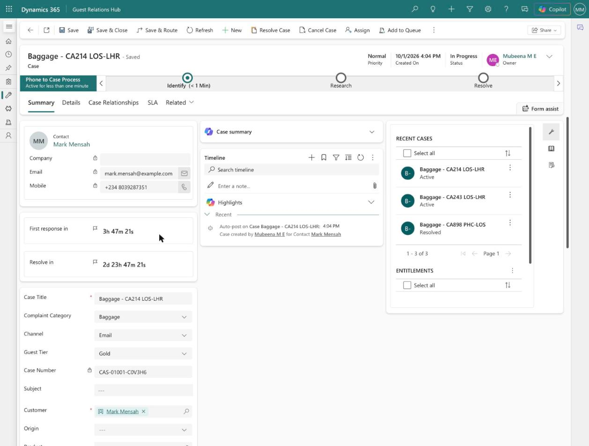
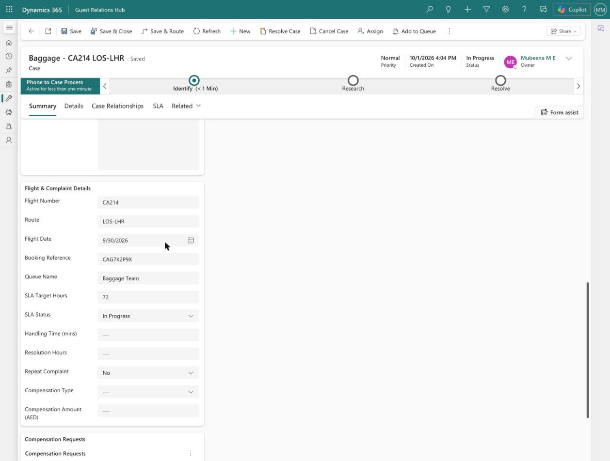
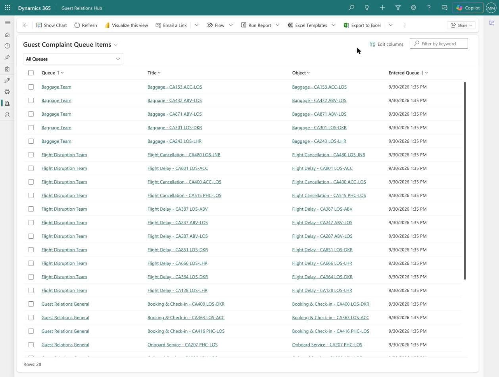
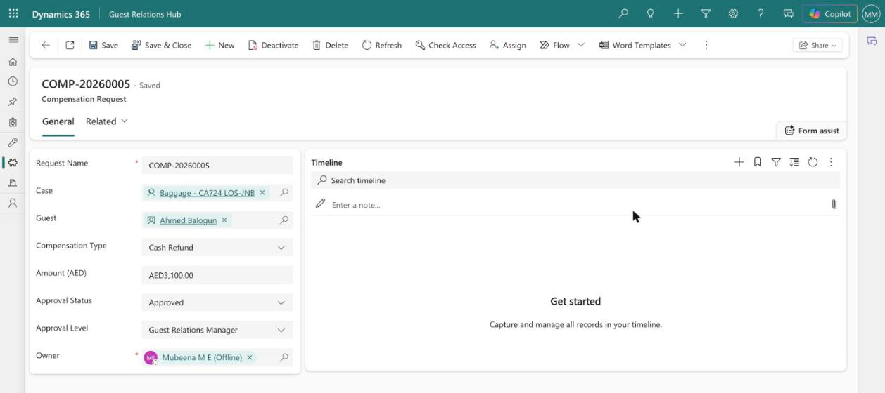
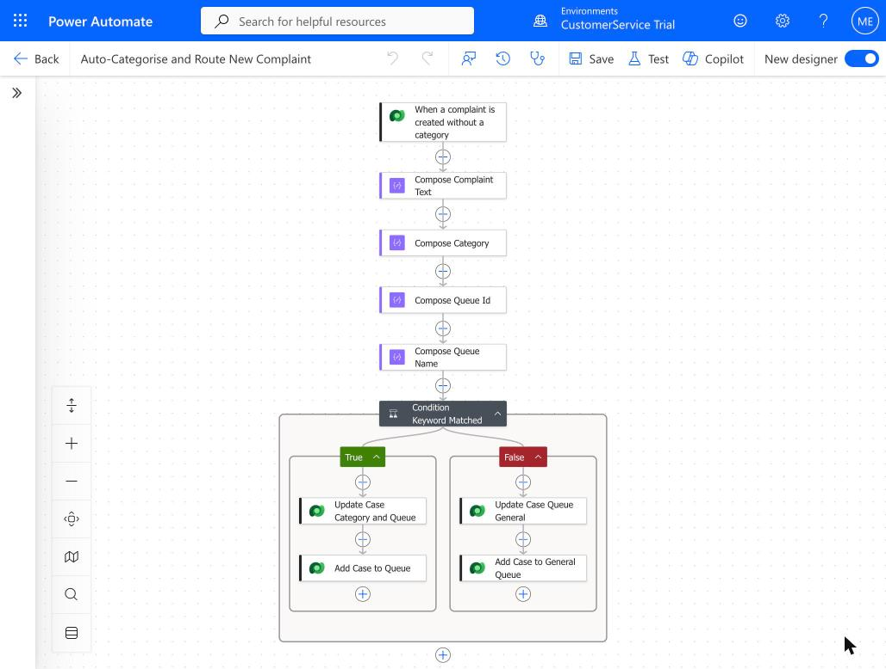
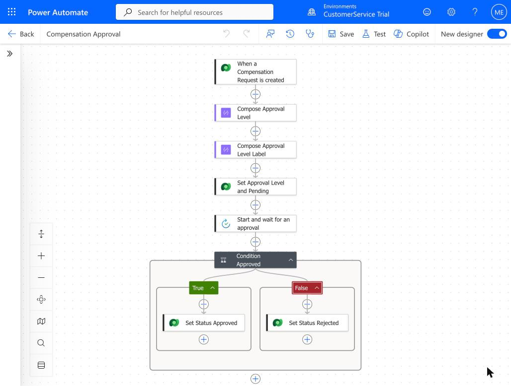
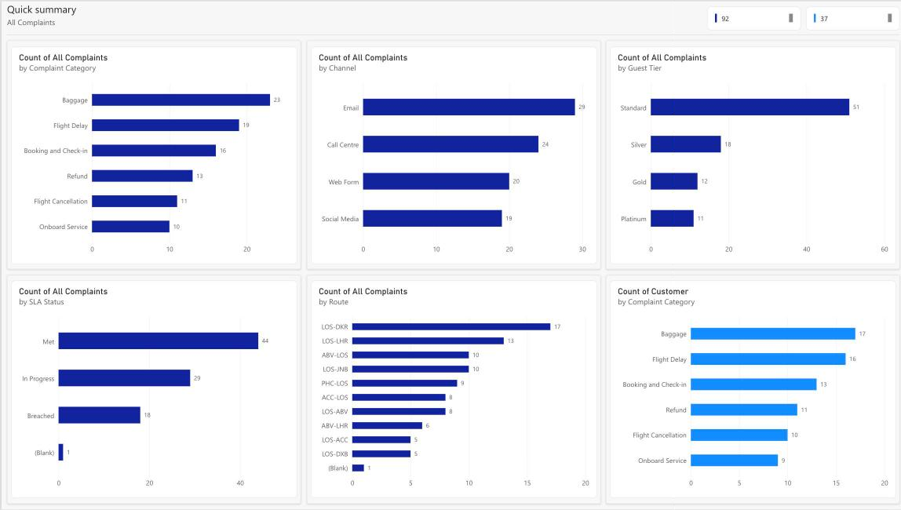

# ✈️ Airline Guest Complaints CRM

> A customer service CRM design for handling passenger complaints end to end in Dynamics 365 Customer Service, with Power BI reporting.

> ℹ️ **Case Study & Prototype** — this repository documents the solution design and a working prototype built in Dynamics 365 Customer Service with sample data (fictional airline: Contoso Airways).

---

## 🌍 Context

A customer service CRM for **a West African airline**.

## 🧩 Business problem

Passenger complaints — **flight delays, cancellations, baggage, refunds / compensation** — arrived through multiple channels:

- 📧 Email
- ☎️ Call centre
- 💬 Social media
- 🌐 Web forms

There was **no central tracking** and **no visibility of resolution times**.

## 💡 Solution overview

Solution design in **Dynamics 365 Customer Service**:

- **One case per complaint**
- **Complaint categories** (delays, cancellations, baggage, refunds / compensation)
- **Queues by team**
- **SLAs by complaint type**
- **Automated case creation and categorisation**
- **Compensation approval workflow**

Reporting in **Power BI**:

- Complaint volume **by route and category**
- **SLA compliance**
- **Resolution time** and **AHT**
- **Repeat complaints**

## 🏗️ Complaint lifecycle

## ✨ Key features

- Single case record for every complaint, whatever the channel
- Complaint categories and team-based queues
- SLAs set per complaint type
- Automated case creation and categorisation
- Compensation approval workflow
- Power BI dashboard: volume by route and category, SLA compliance, resolution time, AHT, repeat complaints

## 👩‍💼 My role

- Solution design for the complaints CRM in Dynamics 365 Customer Service and the Power BI reporting

## 📈 Outcomes

The prototype demonstrates:

- **Single case view across channels** — every complaint (email, call centre, social media, web form) is one Case with flight, booking, guest tier and compensation details in a dedicated *Flight & Complaint Details* section.
- **Automated categorisation and routing** — a Power Automate flow (designed and built in the solution) reads the case title/description for keywords, sets the complaint category and adds the case to the right team queue (Flight Disruption, Baggage, Refunds & Compensation, Guest Relations General).
- **SLA tracking** — a *Guest Complaint SLA* with a 4-hour first response and resolve-by targets of 48h (delays, cancellations, check-in), 72h (baggage, onboard service) and 120h (refunds), shown as live timers on the case.
- **Tiered compensation approval** — a Power Automate approval flow (designed and built in the solution) routes requests up to AED 1,000 to a Team Lead and larger amounts to the Guest Relations Manager, with the approval status written back to the record.
- **Performance reporting** — an in-app *Guest Relations Overview* dashboard and a Power BI report on complaint volume by category, channel, route, guest tier and SLA status.

## 🖼️ Screenshots

> Prototype built in Dynamics 365 Customer Service with sample data (fictional airline: Contoso Airways).

| | |
|---|---|
|  **Guest Relations Overview** — complaints by category, channel, route, open vs resolved, SLA status, and SLA-breached list |  **Open Complaints by Category** — one list across all channels with category, guest tier and SLA status |
|  **Complaint case** — live SLA timers (first response and resolve by) with category, channel and guest tier |  **Flight & Complaint Details** — flight, route, booking reference, queue and SLA fields |
|  **Team queues** — complaints routed to Baggage, Flight Disruption and Guest Relations General |  **Compensation request** — AED 3,100 cash refund approved at Guest Relations Manager level |
|  **Auto-Categorise and Route New Complaint** — Power Automate flow (keyword categorisation + queue routing) |  **Compensation Approval** — Power Automate flow (amount-based approval level + Approvals) |
|  **Power BI report** — complaint volume by channel, guest tier, SLA status, route and category | |

## 🧠 Key learnings

- Bringing every channel into one case record is the first step to measuring resolution times.
- SLAs need to differ by complaint type — a baggage claim and a refund request don't follow the same timeline.
- A clear approval step for compensation keeps decisions consistent and auditable.

---

Built by [Mubeena M E](https://github.com/mubeename) · [LinkedIn](https://www.linkedin.com/in/mubeename)
