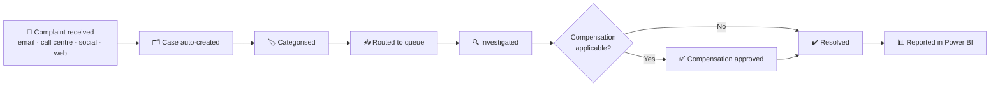

# ✈️ Airline Guest Complaints CRM

> A customer service CRM design for handling passenger complaints end to end in Dynamics 365 Customer Service, with Power BI reporting.

> ⚠️ **Case Study & Prototype (in progress)** — this repository documents the solution design and prototype. It will be updated as the work progresses.

---

## 🌍 Context

A customer service CRM for **a West African airline**.

## 🧩 Business problem

Passenger complaints — **flight delays, cancellations, baggage, refunds / compensation** — arrived through multiple channels:

- 📧 Email
- ☎️ Call centre
- 💬 Social media
- 🌐 Web forms

There was **no central tracking** and **no visibility of resolution times**.

## 💡 Solution overview

Solution design in **Dynamics 365 Customer Service**:

- **One case per complaint**
- **Complaint categories** (delays, cancellations, baggage, refunds / compensation)
- **Queues by team**
- **SLAs by complaint type**
- **Automated case creation and categorisation**
- **Compensation approval workflow**

Reporting in **Power BI**:

- Complaint volume **by route and category**
- **SLA compliance**
- **Resolution time** and **AHT**
- **Repeat complaints**

## 🏗️ Complaint lifecycle

## ✨ Key features

- Single case record for every complaint, whatever the channel
- Complaint categories and team-based queues
- SLAs set per complaint type
- Automated case creation and categorisation
- Compensation approval workflow
- Power BI dashboard: volume by route and category, SLA compliance, resolution time, AHT, repeat complaints

## 👩‍💼 My role

- Solution design for the complaints CRM in Dynamics 365 Customer Service and the Power BI reporting

## 📈 Outcomes

- 🚧 In progress — outcomes will be added once available.

## 🖼️ Screenshots

> _Prototype screenshots coming soon._ Sample data only.

| Complaint case | Queues & SLAs | Compensation approval | Power BI dashboard |
|---|---|---|---|
| _placeholder_ | _placeholder_ | _placeholder_ | _placeholder_ |

## 🧠 Key learnings

- Bringing every channel into one case record is the first step to measuring resolution times.
- SLAs need to differ by complaint type — a baggage claim and a refund request don't follow the same timeline.
- A clear approval step for compensation keeps decisions consistent and auditable.

---

Built by [Mubeena M E](https://github.com/mubeename) · [LinkedIn](https://www.linkedin.com/in/mubeename)
